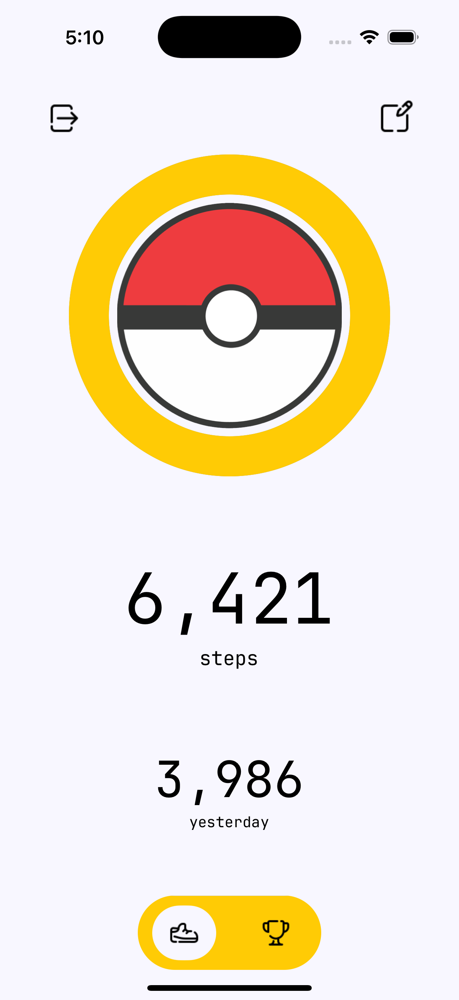
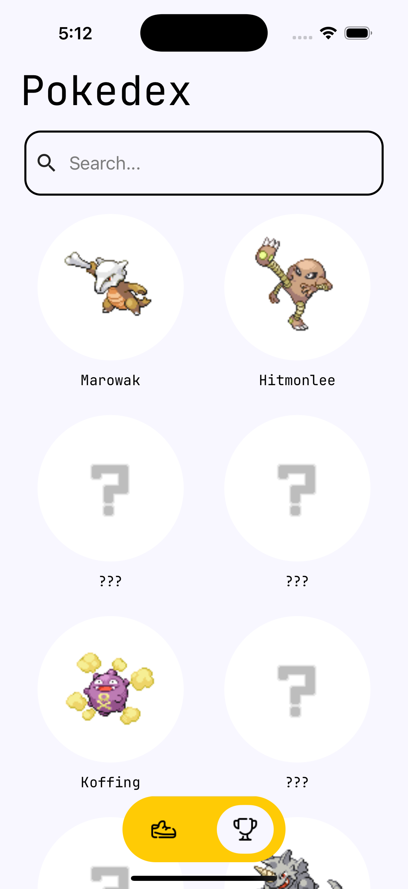

# Pokésteps

An iOS step counter application inspired by Ash Ketchum's Pokémon journey, emphasizing that growth and continuous improvement are as important as achieving the goal.

## :memo: Description

Pokésteps is a gamified fitness app designed to make routine activities like walking more enjoyable and engaging. By integrating elements of gaming, it motivates users to stay active while having fun. Users can unlock and collect all 151 original Pokémon by earning experience points, which are accumulated through their daily step counts. The app leverages HealthKit ([react-native-health](https://github.com/agencyenterprise/react-native-health)) to track steps and PokéAPI to deliver a Pokédex-inspired interface for tracking progress and achievements. With features like customizable step goals, the app caters to both beginners looking to ease into a healthier lifestyle and advanced users trying to push their limits.

<p align="center">
   
   
   
   
</p>

## :electric_plug: Get started

🚨 `react-native-health` package is not included in Expo Go. Therefore, the app must be opened using development build instead of in Expo Go. Use command 2 below to do do.

1. Install dependencies

   ```bash
   npm install
   ```

2. Create an iOS development build

   ```bash
   npm run ios
   ```

3. Create an iOS development build on selected device

   ```bash
   npx expo run:ios -d
   ```

4. Start the app

   ```bash
   npm start
   ```

5. Clear cache and start app

   ```bash
   npm start -c
   ```

In the output, you'll find options to open the app in a

- [Development build](https://docs.expo.dev/develop/development-builds/introduction/)
- [Android emulator](https://docs.expo.dev/workflow/android-studio-emulator/)
- [iOS simulator](https://docs.expo.dev/workflow/ios-simulator/)
- [Expo Go](https://expo.dev/go), a limited sandbox for trying out app development with Expo

Press `i` to open app in iOS simulator.

## :art: Design

<a href="https://www.figma.com/design/NF4VFbFFlSgF2lKkHmrnIH/Pokesteps?node-id=0-1&t=ju9Lg8FPPWWy6UVS-1" target="_blank">Figma design</a>

## :toolbox: Tools

- React Native
- TypeScript
- ExpressJS
- Tailwind/NativeWind
- Expo
- Appwrite (user authentication)
- NeonDB (serverless PostgreSQL)
- Vercel (backend hosting)
- HealthKit ([react-native-health](https://github.com/agencyenterprise/react-native-health))
